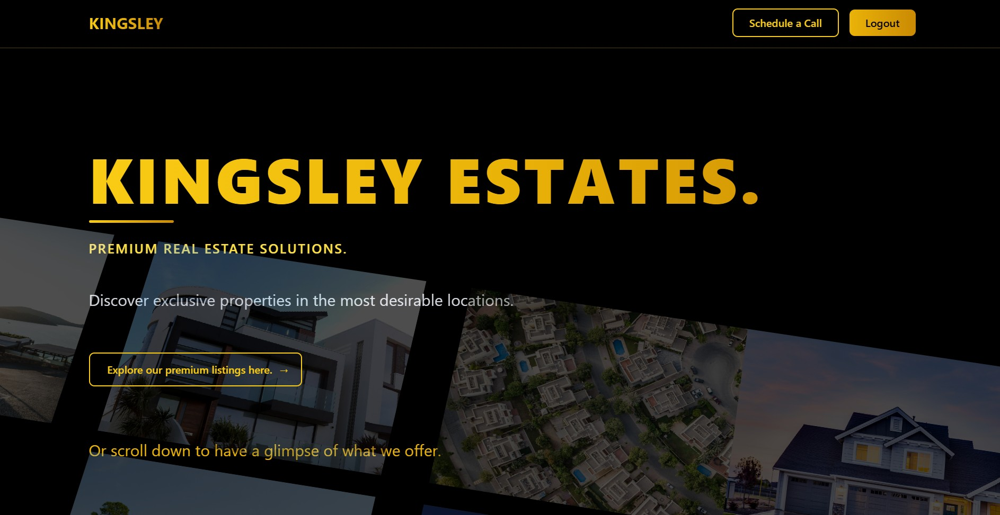
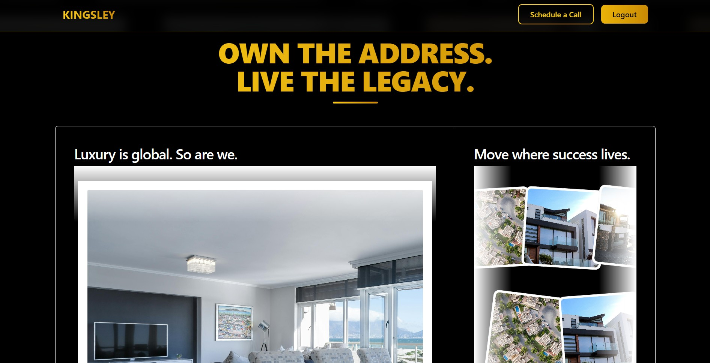
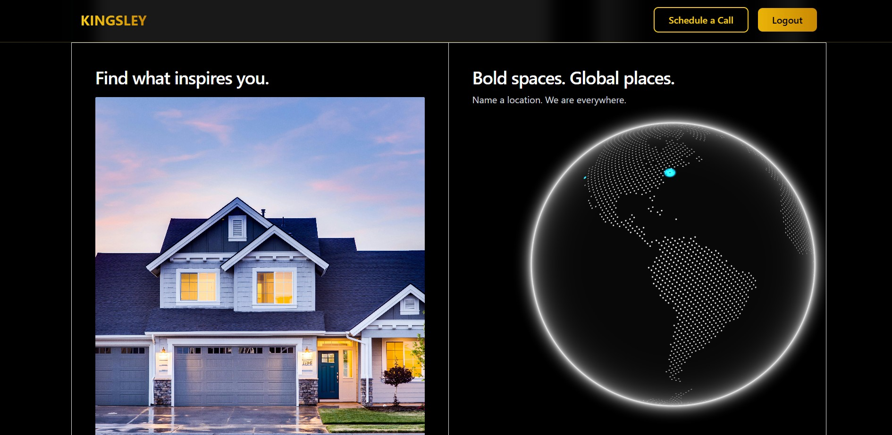
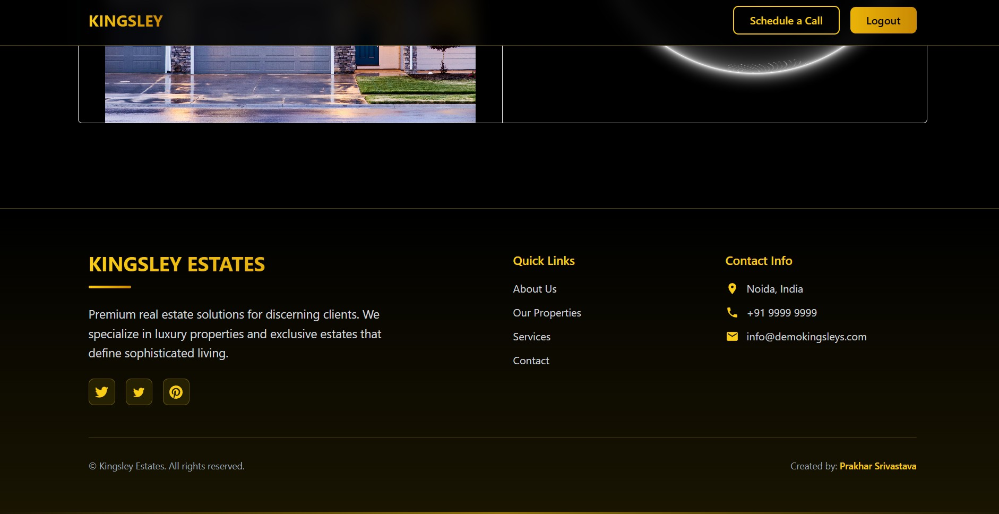
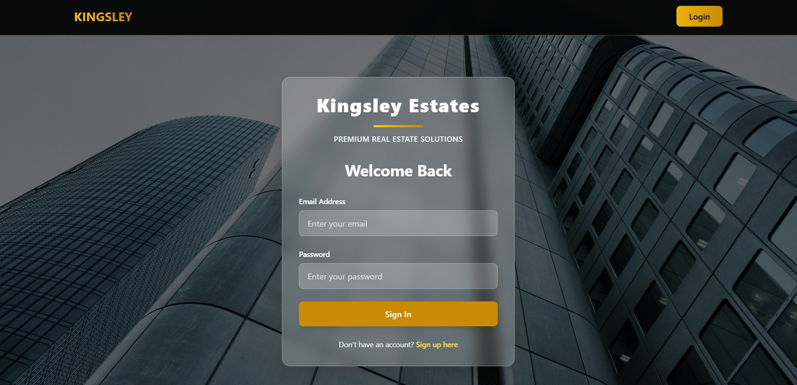
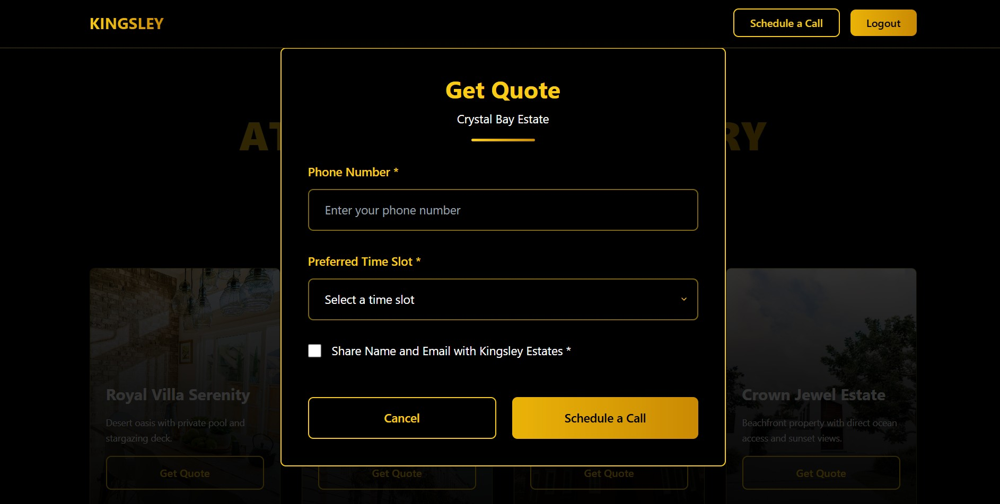

# Kingsley Estates




<div align="center">
  
  
  
  
  
  
  
</div>

Welcome to **Kingsley Estates** — your gateway to premium real estate solutions. Discover exclusive properties in the most desirable locations, with a modern, interactive, and visually stunning web experience.

---

## 🚀 Live Demo

👉 [Visit the Live Site](https://kingsley-estate-frontend.vercel.app)

---

## 🛠️ Tech Stack

- **Frontend:** React, Vite, Tailwind CSS, Framer Motion, Axios, React Router
- **Backend:** Node.js, Express.js, MongoDB (see `/backend`)
- **Deployment:** Vercel (Frontend), Render (Backend)
---

## 🏁 Getting Started

### 1. Clone the Repository

```bash
git clone https://github.com/your-username/kingsley-estate.git
cd kingsley-estate
```

### 2. Install Dependencies

#### Frontend
```bash
cd frontend
npm install
```

#### Backend
```bash
cd ../backend
npm install
```

### 3. Run the Project Locally

#### Start Backend
```bash
cd backend
npm start
```

#### Start Frontend
```bash
cd ../frontend
npm run dev
```

- The frontend will be available at `http://localhost:5173` (or as specified by Vite).
- The backend will be available at `http://localhost:5000` (or as specified in your backend config).

---

## ✨ Features

- Modern, animated UI with Framer Motion
- Responsive design with Tailwind CSS
- Authentication & protected routes
- Real estate listings with beautiful imagery
- Smooth navigation and fast performance

---

## 🤝 Contributing

Pull requests are welcome! For major changes, please open an issue first to discuss what you would like to change.

---

## 📄 License

This project is licensed under the MIT License.

---

> **Kingsley Estates** — Premium Real Estate Solutions.
